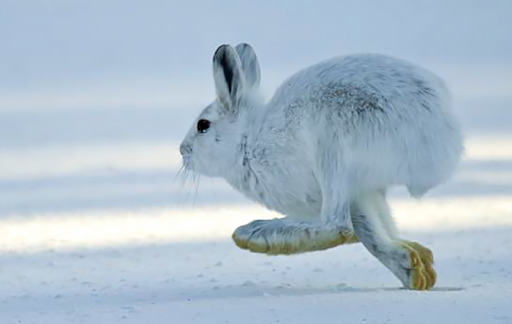

```{r setup, include=FALSE}
knitr::opts_chunk$set(echo = TRUE)

local({
	
	# The directory where Pandoc will be extracted. Feel free
	# to adjust this path as appropriate.
	dir <- "~/rstudio-pandoc"
	
	# The version of Pandoc to be installed.
	version <- "2.7.1"
	
	# Create and move to the requested directory.
	dir.create(dir, showWarnings = FALSE, recursive = TRUE)
	owd <- setwd(dir)
	on.exit(setwd(owd), add = TRUE)
	
	# Construct path to pandoc.
	root <- "https://s3.amazonaws.com/rstudio-buildtools"
	suffix <- sprintf("pandoc-%s-windows-x86_64.zip", version)
	url <- file.path(root, "pandoc-rstudio", version, suffix)
	
	# Download and extract pandoc.
	file <- basename(url)
	utils::download.file(url, destfile = file)
	utils::unzip(file)
	unlink(file)
	
	# Write .Renviron to update the version of Pandoc used.
	entry <- paste("RSTUDIO_PANDOC", shQuote(path.expand(dir)), sep = " = ")
	contents <- if (file.exists("~/.Renviron")) readLines("~/.Renviron")
	filtered <- grep("^RSTUDIO_PANDOC", contents, value = TRUE, invert = TRUE)
	amended <- union(filtered, entry)
	writeLines(amended, "~/.Renviron")
	
	# Report change to the user.
	writeLines("Updated .Renviron:\n")
	writeLines(amended)
	writeLines("\nPlease restart RStudio for these changes to take effect.")
	
})
```

## HW1: Data Wrangling and Visualization with Snowshoe Hares 

Installing all the relevant packages for this assignment 
```{r, echo = FALSE, message = FALSE, warning = FALSE, include = FALSE}
r = getOption("repos")
r["CRAN"] = "http://cran.us.r-project.org"
options(repos = r)
install.packages("here")
install.packages("janitor")
install.packages("kableExtra")
install.packages("naniar")
install.packages("VIM")
install.packages("skimr")
install.packages("ggfortify")
install.packages("sf")
install.packages("tmap")
install.packages("tidyverse") 
install.packages("hrbrthemes")
install.packages("viridis")
install.packages("magrittr")
install.packages("qwraps2")
```

### Attaching all of the relevant packages for this assignment with the library 
```{r, echo = TRUE, message = FALSE, warning = FALSE}
library(tidyverse)
library(janitor)
library(here)
library(kableExtra)
library(naniar)
library(VIM)
library(skimr)
library(ggfortify)
library(sf)
library(tmap)
library(ggplot2)
library(hrbrthemes)
library(qwraps2)
library(magrittr)
```

### Reading in the data to form a new dataframe 
```{r}
snowshoe <- read_csv("showshoe_lter.csv")
```

### Data exploring and wrangling 
```{r}
summary(snowshoe) #Gives a summary of how many different variables there are in the dataframe
View(snowshoe) #Opens a new dataframe with the dataset already in it 
names(snowshoe) #Gives the number of column headers in the data set 
head(snowshoe) #Gives a preview of the data set 
tail(snowshoe) #Gives a preview of the data set 

#Initial reaction: Columns that include NA data are the following: time, right ear, sex, age, hindfoot, and notes. 

#What variables may be related to each other with this data? Could include sex, age, and weight. Maybe grid and date? 

#What do you want to graph with the snowshoe data? 

#Statement: I want to see how the weight of all the snowshoe hares both female and male will vary across the years of the study 
```
 
#Filtering and constructing a new dataframe with desired variables 
```{r}
snowfiltered = subset(snowshoe, select = -c(time, grid, trap, l_ear, r_ear, hindft, notes, b_key, session_id, study)) #Filtered out all the columns that are not desired in the new dataframe 

#Transforming all of the classes of the variables from character to numeric 
```

### Filtering the Dataset 
```{r}
#Filtering the dataset in order to get lower case letters for male and females and filtering out the rest of the NA values 
snow_tidy <- snowfiltered %>%  
  filter(sex %in% c ("f", "m", "M", "F")) %>%  
  mutate(
    sex = case_when(
      sex == "f" ~ "F", 
      sex == "m" ~ "M")) %>%  
  filter(sex!= "NA")
```

### Descriptive introductory summary of what the project is all about (3-4 sentences)
```{r}
#Snowshore hares, otherwise known as Lepus americanus, are a keystone prey species that play an ecologically important role in northern boreal forests and experience population fluctuations of 8-11 years. This capture-recapture study of snowshoe hares was conducted at 5 locales in the Tanana valley from study sites Tok in the east to Clear in the west from 1999-2012 with a time duration of 13 years. Snowshoe hare population densities were the highest in 1999 and declined thereafter. This study did not find any declines in apparent survival during declining densities in these study populations 
```

### Image of the Snowshoe Hare (Lepus americanus) 
```{r echo=FALSE, out.width='100%', fig.align = "center", echo = FALSE}


```

### Finalized graph about the Bonanza Creek snowshoe hare population  
```{r, message = FALSE, warning = FALSE, fig.align="left"}
#Creating a histogram based on the weight of the snowshore hares with a frequency count of the data split between by sex (male/female)
snow_plot <- ggplot(snow_tidy, aes(x=weight, color=sex, fill=sex)) +
  geom_histogram(position="identity", alpha=0.5, brewerPalette="Paired",alpha=0.5) + 
  labs(title="Weight Distribution of Female and Male Snowshoe Hares from 1999 - 2012",x="Weight (g)", y = "Frequency Count of Snowshoe Hares", caption = "Weight distribution of male and female snowshoe hares (Lepus americanus) \n in Bonanza Creek Experimental Forest (1999-2012) \n (Source: https://portal.lternet.edu/nis/metadataviewer?packageid=knb-lter-bnz.55.22)") + 
  theme_bw()

snow_plot+theme(plot.caption=element_text(hjust=0.5))

```

#Creating a New Data Frame with Desirable Traits  
```{r}

#Creating a new data frame to include variables that cannot be analyzed in the numeric class 
snowtable = subset(snowshoe, select = -c(time, grid, trap, l_ear, session_id, study, notes, b_key, age, r_ear, hindft)) 

#Renaming columns in the dataframe to be capitalized 
names(snowtable)[names(snowtable) == "sex"] <- "Sex"
names(snowtable)[names(snowtable) == "date"] <- "Year of Study"
names(snowtable)[names(snowtable) == "weight"] <- "Weight of Hare (g)"


#Filtering out the NA values for the new data frame to only get male and female 
snow_analysis <- snowtable %>%  
  filter(Sex %in% c ("f", "m", "M", "F")) %>%  
  mutate(
    Sex = case_when(
      Sex == "f" ~ "F", 
      Sex == "m" ~ "M")) %>%  
  filter(Sex!= "NA")

#Filtering out female snowshow hares to only get the males for data analysis results  
snow_male <- snow_analysis %>%  
 filter(Sex!= "F")

snow_male

#Filtering out male snowshow hares to only get the females for data analysis results 
snow_female <- snow_analysis %>%  
 filter(Sex!= "M")

snow_female
```

#Creating the Finalized HTML Data Table 
```{r}

#Calculating Descriptive Statistics of the Weight of Female Snowshoe Hares 
mean(snow_female$`Weight of Hare (g)`, na.rm = TRUE)
#1289.994
median(snow_female$`Weight of Hare (g)`, na.rm = TRUE)
#1350 
sd(snow_female$`Weight of Hare (g)`, na.rm = TRUE)
#325.08004 
min(snow_female$`Weight of Hare (g)`, na.rm = TRUE)
#240 
max(snow_female$`Weight of Hare (g)`, na.rm = TRUE)
#2170 
range(snow_female$`Weight of Hare (g)`, na.rm = TRUE)
#1930 

snow_tbl <- data.frame(
  Statistics = c("Mean", "Median", "Standard Deviation", "Minimum", "Maximum", "Range"),
  Calculations = c(
    "1,290 ",
    "1,350", 
    "325 ", 
    "240", 
    "2,170", 
    "1,930"
  )
)

kable(snow_tbl, caption = '<b>Female Snowshoe Hare Weight Descriptive Statistics</b>') %>%
  kable_styling(full_width = F) %>% 
  column_spec(1, bold = T, border_right = T) %>%
  column_spec(2, width = "30em", background = "white") %>%  
  footnote(general = "Descriptive statistics which calculate the mean to range of weights for all female snowshoe hare populations in Bonanza Creek Experimental Forest (1999-2012)")    
  
  
```

